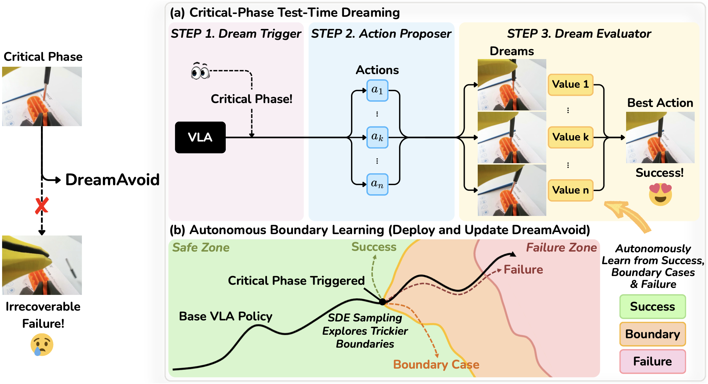

# DreamAvoid

DreamAvoid is a critical-phase test-time dreaming framework for VLA (Vision-Language-Action) manipulation. The base policy is executed directly during routine steps, and test-time dreaming is invoked only when the system predicts an imminent transition into a critical phase.

The system has three modules: a **Dream Trigger** that decides when to intervene, an **Action Proposer** that samples multiple candidate action chunks, and a **Dream Evaluator** that scores candidates by forward-simulating their short-horizon futures with an action-conditioned world model and a value model.

<video src="https://drive.google.com/uc?export=download&id=1YI2vJYQpwIoHb0ship5vkSFgl7bgAfIc" controls="controls" width="100%">
</video>

<p align="center">
  
</p>

## Repository Layout

```
DreamAvoid/
├── openpi-da/        # VLA policy + Dream Trigger + Action Proposer + Value Model
│   ├── src/openpi/   # Policy core (flow-matching + SDE sampling, training, transforms)
│   ├── agilex/       # Real-robot deployment, trigger / value training, data tools
│   └── scripts/      # Train, compute norm stats, policy serving
└── DreamDojo-da/     # Action-conditioned world model used by the Dream Evaluator
    ├── examples/     # Inference / serving entry points (server + action-conditioned rollouts)
    ├── configs/      # Per-task generation configs
    └── scripts/      # World-model training entry point
```

## Method to Code

### 1. Dream Trigger

A lightweight network `f_phi(O_{t-K+1:t}, s_t) -> p_t` that takes the recent K-frame multi-view observations plus the proprioceptive state and outputs the probability that the system has entered a critical phase. Triggers when `p_t >= gamma`.

| Component | File |
|---|---|
| Critical-phase annotation tool (`t_crit`) | `openpi-da/agilex/annotate_t_crit.py` |
| Trainer (soft label `sigmoid((t - t_crit) / beta)`, class-balanced BCE with `w_+ = N_-/N_+`) | `openpi-da/agilex/train_dream_trigger.py` |
| Online inference + threshold gating | `openpi-da/agilex/agilex_infer_dream_trigger.py` |

### 2. Action Proposer

Replaces the deterministic ODE inference of the flow-matching base policy with the corresponding SDE
`du = v_theta(u, rho | o_t, l) drho + sigma(rho) dW_rho`,
generating multiple candidate action chunks per critical step. A constant noise schedule is used; per-task `sigma` values are configured at the policy level.

| Component | File |
|---|---|
| SDE flow-matching model (config + sampler) | `openpi-da/src/openpi/models/pi0_sde.py` |
| SDE policy server (multi-candidate sampling) | `openpi-da/scripts/serve_sde_policy.py` |
| Combined policy server (base + SDE proposer) | `openpi-da/scripts/serve_combined_policy.py` |

### 3. Dream Evaluator

Pairs an action-conditioned world model with a value model. For each candidate `u_t^{(k)}`, the world model predicts the future observation sequence `y_hat_t^{(k)}`, and the value model `V_omega(o_t, u_t, y_hat) -> z` regresses the continuous **progress delta** `z_t^{(k)} = eta_{t+H} - eta_t in [-1, 1]`, where `eta` is a frame-level progress score from a general-purpose reward model (Robometer). A boundary-penalty mechanism truncates `z` to `-1` whenever Robometer detects an irreversible failure inside the horizon (e.g. a precipitous drop in success probability). The candidate with the highest predicted `v_hat^{(k)}` is executed.

A *real–dream joint training* strategy is used: real future frames `y_true` and dreamed frames `y_hat` are fed to the same value model with **shared Robometer-derived labels** (always scored on the real future), so the network learns from clean visuals while staying robust to the artifacts of the world model. Because routine teleoperation data is overwhelmingly steady-progression, training batches are formed via priority-based oversampling — by default 20% terminal successes, 40% boundary + failure clips, and 40% steady progression. The objective is a **Huber regression** loss plus a **continuous margin-ranking** term that requires the predicted score gap between an `(i, j)` pair with `z_i > z_j` to satisfy `v_hat_i - v_hat_j >= alpha (z_i - z_j)`.

| Component | File |
|---|---|
| Continuous progress-delta labels, boundary penalty, bucket assignment, priority oversampling, real-dream joint training, Huber + continuous margin-ranking loss | `openpi-da/agilex/train_value_model.py` |
| Value model inference helper | `DreamDojo-da/examples/value_model.py` |
| Action-conditioned world model rollout (rollout on candidate actions) | `DreamDojo-da/examples/action_conditioned.py` |
| World-model server (used during inference) | `DreamDojo-da/examples/dreamdojo_server.py` |
| Distilled world-model server (low-latency rollouts at deploy time) | `DreamDojo-da/examples/dreamdojo_server_distill.py` |
| World-model training | `DreamDojo-da/scripts/train.py` |

### 4. Autonomous Boundary Learning

The base policy is trained on successful trajectories only, while the value model is trained on both successful and failed trajectories. Because human teleoperation data is overwhelmingly successful, an initial DreamAvoid (trained on `D_teleop`) is deployed to collect a mixed dataset `D_online` of successful, boundary, and failed trajectories. The Dream Evaluator is then fine-tuned on `D_teleop ∪ D_online`.

| Component | File |
|---|---|
| Episode collection / replay tools | `openpi-da/agilex/collect_data/` |
| Bucket assignment (`{success, steady, stagnation, boundary, failure}`) and joint dataset construction over real and dreamed trajectories | `openpi-da/agilex/train_value_model.py` |

> The dataset bucketing and value-model fine-tuning are implemented; the end-to-end "deploy v0 → roll out → re-train evaluator" loop is run manually by chaining the collection scripts and re-launching value-model training.

## End-to-End Inference Flow

At each step `t`:

1. Run the Dream Trigger on the recent observation buffer and proprioception.
2. If `p_t < gamma`, execute the next chunk from the base VLA policy and continue.
3. If `p_t >= gamma`:
   1. Sample `K` candidate action chunks via the Action Proposer (SDE flow-matching).
   2. For each candidate, roll out the world model to obtain a predicted future clip.
   3. Score each candidate with the value model.
   4. Execute the highest-scoring candidate's chunk.

The deployment entry point that ties these pieces together is `openpi-da/agilex/agilex_infer_dream_trigger.py`, which talks to the policy server, the Dream Trigger, the world-model server, and the value model.

## Training Entry Points

| Stage | Script |
|---|---|
| Base VLA policy (flow-matching) | `openpi-da/scripts/train.py` |
| SDE sampler / proposer | shares the base policy weights; configured via `pi0_sde` model config |
| Dream Trigger | `openpi-da/agilex/train_dream_trigger.py` |
| Value model (Dream Evaluator) | `openpi-da/agilex/train_value_model.py` |
| World model | `DreamDojo-da/scripts/train.py` |

## Serving Entry Points

| Service | Script |
|---|---|
| Base VLA policy server | `openpi-da/scripts/serve_policy.py` |
| SDE proposer policy server | `openpi-da/scripts/serve_sde_policy.py` |
| Combined (base + proposer) policy server | `openpi-da/scripts/serve_combined_policy.py` |
| World-model server (full) | `DreamDojo-da/examples/dreamdojo_server.py` |
| World-model server (distilled) | `DreamDojo-da/examples/dreamdojo_server_distill.py` |
